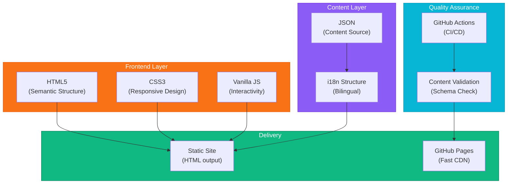

<div align="center">

# Badminton Coach


**[English](README.md) | [中文](README_CN.md)**

[](https://badminton.bojiang.org/)
[](https://github.com/hakupao)
[](https://developer.mozilla.org/en-US/docs/Web/HTML)
[](https://developer.mozilla.org/en-US/docs/Web/CSS)
[](https://developer.mozilla.org/en-US/docs/Web/JavaScript)
[](/)
[](https://github.com/features/actions)
[](LICENSE)

</div>

---

## 📋 Overview

Badminton Coach is a comprehensive bilingual badminton coaching notebook and knowledge base. Built as a static website with JSON-first content architecture, it provides structured course materials, interactive knowledge cards, and guided training programs for badminton enthusiasts at all levels.

**Live Demo:** [badminton.bojiang.org](https://badminton.bojiang.org/)

<div align="center">
  
</div>


---

## ✨ Key Features

<table>
<tr>
<td>🌐</td>
<td><strong>Bilingual Content</strong><br/>Complete ZH/EN support for Chinese and English speakers</td>
</tr>
<tr>
<td>📚</td>
<td><strong>Structured Course Library</strong><br/>Well-organized courses from basics to advanced techniques</td>
</tr>
<tr>
<td>🎓</td>
<td><strong>Knowledge Cards</strong><br/>Interactive learning cards with key concepts and techniques</td>
</tr>
<tr>
<td>📋</td>
<td><strong>Training Guides</strong><br/>Step-by-step training programs and practice routines</td>
</tr>
<tr>
<td>📐</td>
<td><strong>Learning Paths</strong><br/>Guided progression from beginner to advanced player</td>
</tr>
<tr>
<td>⚡</td>
<td><strong>Fast & Lightweight</strong><br/>Pure HTML/CSS/JS, zero dependencies, instant load</td>
</tr>
<tr>
<td>✅</td>
<td><strong>Content Validation</strong><br/>Automated CI checks for content quality and consistency</td>
</tr>
</table>

---

## 🏗️ Architecture



---

## 🚀 Tech Stack

| Component | Technology | Details |
|-----------|-----------|---------|
| **Frontend** | HTML5 + CSS3 | Semantic, responsive |
| **Interactivity** | Vanilla JavaScript | ES6+, no frameworks |
| **Content** | JSON | Structured data format |
| **Internationalization** | Custom i18n | ZH/EN language support |
| **Static Generation** | HTML + Templates | Pre-built pages |
| **Hosting** | GitHub Pages | Free, fast, reliable |
| **CI/CD** | GitHub Actions | Automated validation |

---

## 📸 Features Showcase

<details>
<summary><strong>🏠 Home & Navigation</strong></summary>

Clean, bilingual homepage with intuitive navigation and course browsing.


</details>

<details>
<summary><strong>📚 Course Structure</strong></summary>

Organized course modules covering fundamentals, techniques, and strategy.


</details>

<details>
<summary><strong>🎓 Knowledge Cards</strong></summary>

Interactive cards explaining key concepts with examples and practice tips.


</details>

<details>
<summary><strong>📖 Training Guides</strong></summary>

Detailed training programs with exercises, drills, and progression levels.


</details>

<details>
<summary><strong>🎯 Learning Paths</strong></summary>

Structured progression paths helping users advance systematically.


</details>

<details>
<summary><strong>🌐 Bilingual Interface</strong></summary>

Seamless language switching between English and Chinese.


</details>

---

## 🚀 Getting Started

### Prerequisites
- Node.js 18+ (for development)
- npm or pnpm
- Git

### Installation

```bash
# Clone the repository
git clone https://github.com/hakupao/badminton-coach.git
cd badminton-coach

# Install dependencies
npm install

# Start development server
npm run dev
```

Open [http://localhost:3000](http://localhost:3000) in your browser.

### Building for Production

```bash
# Build static site
npm run build

# Output: dist/ directory ready for deployment
```

---

## 📖 Content Structure

### Content Organization

```
content/
├── i18n/
│   ├── en/                          # English content
│   │   ├── courses/
│   │   │   ├── fundamentals.json
│   │   │   ├── techniques.json
│   │   │   └── strategy.json
│   │   ├── knowledge-cards/
│   │   │   ├── basics.json
│   │   │   └── advanced.json
│   │   └── training-guides/
│   │       ├── beginner.json
│   │       └── intermediate.json
│   └── zh/                          # Chinese content
│       ├── courses/
│       ├── knowledge-cards/
│       └── training-guides/
└── schemas/                         # JSON validation schemas
    ├── course.schema.json
    ├── knowledge-card.schema.json
    └── training-guide.schema.json
```

### Content Format Example

```json
{
  "id": "basic-grip",
  "title": "Basic Grip Technique",
  "title_zh": "基础握拍技术",
  "category": "fundamentals",
  "level": "beginner",
  "content": "The proper grip is essential...",
  "content_zh": "正确的握拍方式至关重要...",
  "tips": ["Keep wrist relaxed", "Maintain consistent grip"],
  "tips_zh": ["保持手腕放松", "握拍保持一致"],
  "video_url": "https://...",
  "related_topics": ["wrist-action", "forehand-stroke"]
}
```

---

## 🛠️ Development Guide

### Available Scripts

```bash
npm run dev              # Start development server
npm run build           # Build for production
npm run validate        # Validate content schema
npm run lint            # ESLint code checking
npm run format          # Format code & content
npm run test            # Run tests
```

### Project Structure

```
badminton-coach/
├── src/
│   ├── index.html          # Main entry point
│   ├── css/
│   │   ├── style.css       # Main styles
│   │   └── responsive.css  # Mobile responsive
│   ├── js/
│   │   ├── main.js         # Core logic
│   │   ├── i18n.js         # Language switching
│   │   ├── course-loader.js # Content loading
│   │   └── ui.js           # UI interactions
│   ├── assets/
│   │   ├── images/
│   │   └── icons/
│   └── layouts/
│       ├── course.html
│       ├── card.html
│       └── guide.html
├── content/                # Content JSON files
├── scripts/                # Build & validation scripts
├── .github/workflows/      # CI/CD workflows
└── package.json
```

---

## 📋 Content Validation

### Automated Content Checks

The CI/CD pipeline validates:

```yaml
# GitHub Actions Workflow
- JSON schema validation
- Missing translation checks
- Broken link detection
- Content completeness
- SEO meta-data presence
```

### Running Local Validation

```bash
# Validate all content
npm run validate

# Validate specific language
npm run validate -- --lang en

# Strict mode with warnings
npm run validate -- --strict
```

---

## 🌐 Language Support

### Adding New Content

1. Create JSON file in `content/i18n/en/` (English)
2. Create corresponding `content/i18n/zh/` (Chinese)
3. Run validation: `npm run validate`
4. Deploy to production

### Language Switching

Users can toggle between EN/ZH via UI button. Language preference is saved in localStorage.

```javascript
// Switch language programmatically
changeLanguage('en');  // English
changeLanguage('zh');  // Chinese
```

---

## 🔄 Continuous Integration

### GitHub Actions Workflow

```yaml
name: Content Validation & Deploy

on:
  push:
    branches: [main]
  pull_request:
    branches: [main]

jobs:
  validate:
    - Lint code
    - Validate content schema
    - Check translations
    - Run tests

  build:
    - Build static site
    - Optimize assets

  deploy:
    - Deploy to GitHub Pages
```

---

## 🔒 Security

- Static site, no backend vulnerabilities
- Content sanitization for user-generated inputs
- CSP headers configured
- No external script dependencies
- Regular security audits via dependabot

---

## 📊 Performance

### Optimization Features

- Lightweight (~50KB total gzipped)
- Zero external dependencies
- Instant page loads
- CSS media queries for responsive design
- Lazy image loading
- Cached API responses (if any)

### Performance Metrics

```
Lighthouse Score: 95+
First Contentful Paint: <1s
Time to Interactive: <2s
Cumulative Layout Shift: 0.01
```

---

## 🎯 Learning Path Examples

<details>
<summary><strong>🥇 Beginner Path</strong></summary>

1. Equipment & Court Familiarization
2. Basic Grip & Stance
3. Forehand Stroke
4. Backhand Stroke
5. Footwork Fundamentals
6. Simple Rally Practice

</details>

<details>
<summary><strong>🥈 Intermediate Path</strong></summary>

1. Advanced Footwork
2. Net Play Techniques
3. Drop Shot Mastery
4. Smash Preparation
5. Doubles Strategy
6. Competitive Drills

</details>

<details>
<summary><strong>🥉 Advanced Path</strong></summary>

1. Match Tactics & Psychology
2. Professional Techniques
3. Tournament Preparation
4. Video Analysis
5. Coaching Others
6. Performance Optimization

</details>

---

## 📄 License

This project is licensed under the MIT License - see the [LICENSE](LICENSE) file for details.

---

## 🤝 Contributing

Contributions are welcome! Please:

1. Fork the repository
2. Create a feature branch (`git checkout -b feature/NewContent`)
3. Add or improve content/features
4. Run validation (`npm run validate`)
5. Submit a pull request

### Content Contribution Guidelines

- Follow JSON schema format
- Provide both EN and ZH translations
- Include examples and practice tips
- Link related topics
- Add difficulty level indicator

---

## 📞 Support

For questions, improvements, or content suggestions:

- Open an [issue](https://github.com/hakupao/badminton-coach/issues)
- Submit a [pull request](https://github.com/hakupao/badminton-coach/pulls)
- Check [discussions](https://github.com/hakupao/badminton-coach/discussions)

---

## 🗺️ Roadmap

- [ ] Video integration for technique demonstration
- [ ] Interactive drills with progress tracking
- [ ] User accounts for personalized learning paths
- [ ] Mobile app version
- [ ] Community discussion forum
- [ ] Coach verification system
- [ ] Tournament preparation modules

---

<div align="center">

**Made with ❤️ by [hakupao](https://github.com/hakupao)**

**Visit:** [badminton.bojiang.org](https://badminton.bojiang.org/)

[⬆ back to top](#badminton-coach)

</div>
