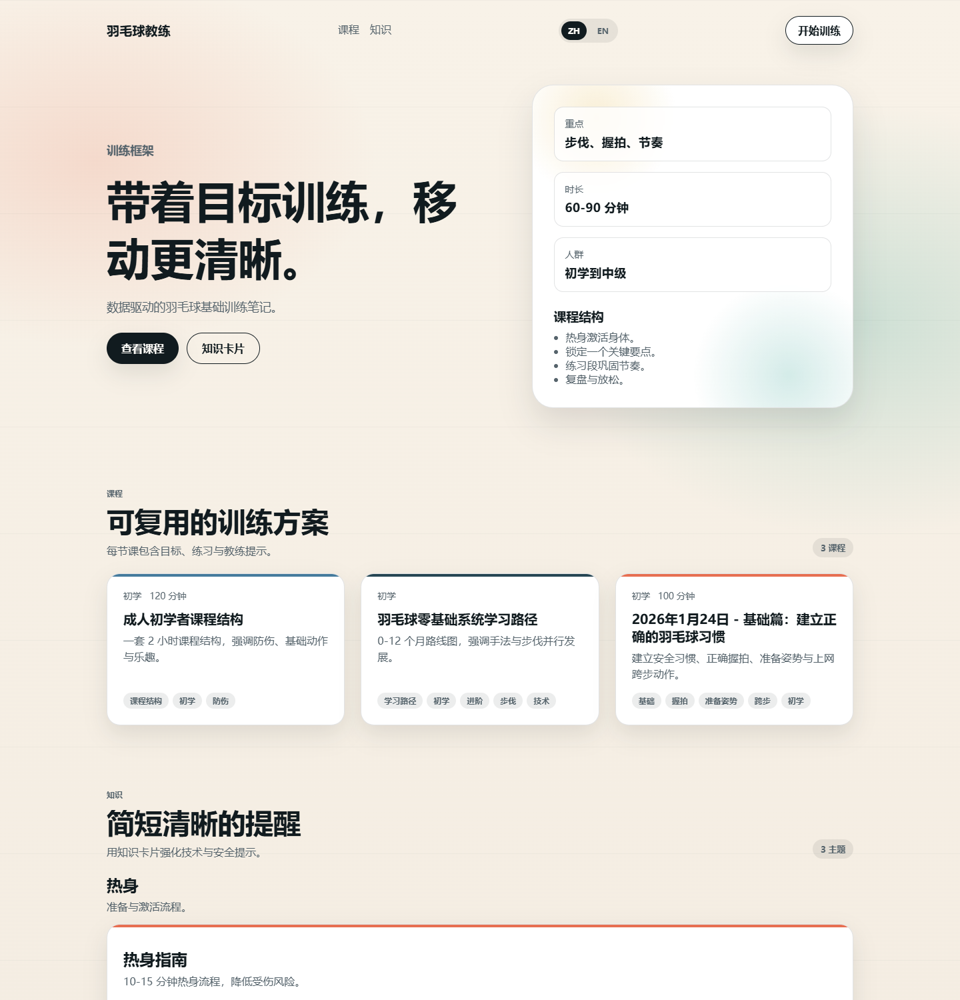
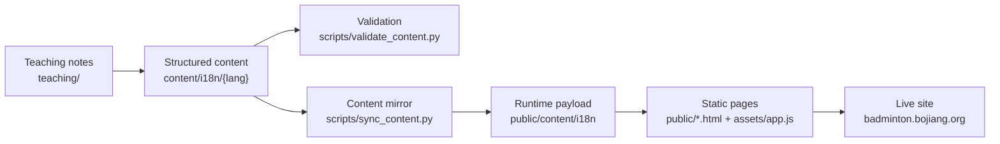

# Badminton Coach

<p align="center">
  <strong>A bilingual badminton coaching notebook turned into a public-facing static site.</strong>
</p>

<p align="center">
  把个人羽毛球教学笔记、课程结构和基础知识卡片，整理成一个可持续维护、可直接部署、适合公开展示的双语静态网站。
</p>

<p align="center">
  <a href="https://badminton.bojiang.org/"></a>
  <a href="https://github.com/hakupao/badminton-coach/actions/workflows/content-quality.yml"></a>
  
  
  
</p>



## 项目简介

`Badminton Coach` 不是一个“只放几篇文章的练习站”，而是把个人羽毛球教学经验做成结构化内容系统的尝试。

这个项目的核心想法是：把成人初学者训练中最常用、最值得反复复用的内容，例如课程结构、训练目标、步伐与手法要点、安全提示、课后拉伸，统一收敛成可维护的 JSON 内容层，再用一个足够轻的静态前端去渲染它。

结果是一个同时具备下面几种属性的网站：

- 它是个人兴趣项目，也是一个完整的公开作品。
- 它是教学笔记，也是一个可以持续扩充的双语知识库。
- 它没有后端和复杂构建，但依然有内容校验、镜像同步和 CI 约束。

## 在线体验

- 主页: [badminton.bojiang.org](https://badminton.bojiang.org/)
- English version: [badminton.bojiang.org/?lang=en](https://badminton.bojiang.org/?lang=en)
- 示例课程: [成人初学者课程结构](https://badminton.bojiang.org/course.html?slug=adult-beginner-session-structure&lang=zh)
- 示例知识卡片: [正手握拍基础](https://badminton.bojiang.org/knowledge.html?slug=forehand-grip-basics&lang=zh)

## 项目内核

- 以成人初学者为中心。内容重点不是炫技，而是安全、动作习惯、学习路径和可重复执行的训练结构。
- 以结构化内容为中心。站点文案、课程卡片、知识卡片、详情页数据全部落在 `content/i18n/{lang}` 中。
- 以轻前端为中心。页面由 HTML、CSS 和 Vanilla JS 直接驱动，没有框架依赖，也没有必须的打包步骤。
- 以可维护性为中心。内容有 schema 约束，`public/content/i18n` 由脚本同步，CI 会检查语言一致性和镜像是否过期。

## 适用场景

- 个人教练或羽毛球爱好者，希望把零散训练笔记整理成一个公开、清晰、可分享的网站。
- 训练营、社群或小俱乐部，需要沉淀基础课程模板、训练目标和安全提示。
- 想做一个“内容优先”的 side project，用很小的技术栈展示内容建模、i18n、静态部署和工程习惯。
- 想把个人知识库做得更像产品，而不是停留在 Markdown 笔记或临时文档。

## 内容流



## 技术与实现

- 前端：原生 HTML、CSS、Vanilla JS
- 内容层：双语 JSON，按 `site / course / knowledge` 分层组织
- 辅助脚本：Python 用于内容校验与运行时镜像同步
- 质量保障：GitHub Actions 检查内容结构、语言 parity 和静态镜像一致性
- 部署形态：纯静态托管，站点默认中文，可通过 `?lang=en` 切换到英文

## 仓库结构

```text
.
├─ teaching/                  # 原始教学笔记、课程思路与训练框架
├─ content/i18n/              # 双语内容源数据（source of truth）
│  ├─ zh/
│  └─ en/
├─ public/                    # 静态页面、样式、脚本和运行时内容镜像
│  ├─ assets/
│  └─ content/i18n/
├─ scripts/                   # validate / sync 工具
└─ .github/workflows/         # CI 内容检查
```

## 本地运行

先在仓库根目录启动一个静态服务，让 `/content/i18n` 能被访问：

```bash
python scripts/validate_content.py
python scripts/sync_content.py
python -m http.server
```

然后打开：

- `http://localhost:8000/public/index.html`
- `http://localhost:8000/public/index.html?lang=en`

## 内容维护方式

- `content/i18n` 是唯一内容源，不要手改 `public/content/i18n`。
- 新增课程时，需要同时补 `course/index.json` 和对应详情 JSON。
- 新增知识卡片时，需要同时补 `knowledge/index.json` 和对应详情 JSON。
- `zh` 与 `en` 目录保持相同结构，CI 会检查文件 parity 与 slug 对齐。
- 站点 UI 文案位于 `content/i18n/{lang}/site.json`。

## 为什么这个仓库适合公开展示

- 它有明确主题，不是通用模板站。
- 它把“个人兴趣”转成了“有结构的产品表达”。
- 它展示的不是单一页面，而是一套完整的内容建模、前端呈现和维护流程。
- 它足够轻，但并不随意，适合作为个人主页作品、公开仓库首页和长期更新项目。
