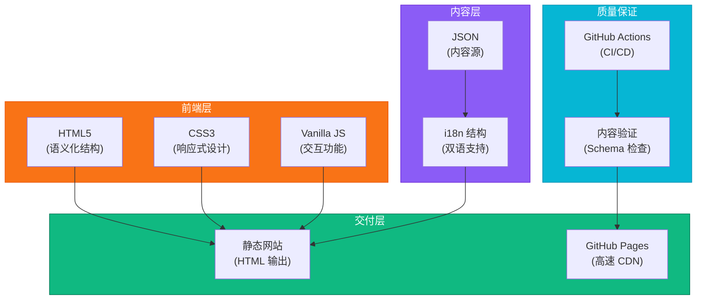

<div align="center">

# 羽毛球教练

<svg width="100%" height="120" viewBox="0 0 800 120" xmlns="http://www.w3.org/2000/svg">
  <defs>
    <linearGradient id="headerGrad" x1="0%" y1="0%" x2="100%" y2="100%">
      <stop offset="0%" style="stop-color:#f97316;stop-opacity:1" />
      <stop offset="100%" style="stop-color:#ea580c;stop-opacity:1" />
    </linearGradient>
  </defs>
  <rect width="800" height="120" fill="url(#headerGrad)"/>
  <text x="400" y="50" font-size="48" font-weight="bold" fill="white" text-anchor="middle" font-family="Arial">🏸 教练</text>
  <text x="400" y="85" font-size="20" fill="#fed7aa" text-anchor="middle" font-family="Arial">双语羽毛球教学知识库</text>
</svg>

**[English](README.md) | [中文](README_CN.md)**

[](https://badminton.bojiang.org/)
[](https://github.com/hakupao)
[](https://developer.mozilla.org/en-US/docs/Web/HTML)
[](https://developer.mozilla.org/en-US/docs/Web/CSS)
[](https://developer.mozilla.org/en-US/docs/Web/JavaScript)
[](/)
[](https://github.com/features/actions)
[](LICENSE)

</div>

---

## 📋 项目介绍

羽毛球教练是一个全面的双语羽毛球教学笔记和知识库。采用 JSON 优先的内容架构，以静态网站形式呈现，为各水平的羽毛球爱好者提供结构化课程材料、互动知识卡片和系统的训练指南。

**在线演示:** [badminton.bojiang.org](https://badminton.bojiang.org/)

---

## ✨ 核心功能

<table>
<tr>
<td>🌐</td>
<td><strong>双语内容支持</strong><br/>完整的中英文支持，方便各地使用者</td>
</tr>
<tr>
<td>📚</td>
<td><strong>结构化课程库</strong><br/>从基础到进阶的完整课程体系</td>
</tr>
<tr>
<td>🎓</td>
<td><strong>知识卡片</strong><br/>交互式学习卡片，关键概念一目了然</td>
</tr>
<tr>
<td>📋</td>
<td><strong>训练指南</strong><br/>循序渐进的训练计划和练习程序</td>
</tr>
<tr>
<td>📐</td>
<td><strong>学习路径</strong><br/>从初学者到高级选手的引导式晋级路线</td>
</tr>
<tr>
<td>⚡</td>
<td><strong>快速轻量</strong><br/>纯 HTML/CSS/JS，零依赖，秒速加载</td>
</tr>
<tr>
<td>✅</td>
<td><strong>内容质量保证</strong><br/>自动化 CI 检查确保内容质量和一致性</td>
</tr>
</table>

---

## 🏗️ 架构设计



---

## 🚀 技术栈

| 组件 | 技术 | 详情 |
|------|------|------|
| **前端** | HTML5 + CSS3 | 语义化、响应式 |
| **交互** | Vanilla JavaScript | ES6+，无框架 |
| **内容** | JSON | 结构化数据 |
| **国际化** | 自定义 i18n | 中英文双语支持 |
| **静态生成** | HTML + 模板 | 预构建页面 |
| **托管** | GitHub Pages | 免费、快速、稳定 |
| **CI/CD** | GitHub Actions | 自动化验证 |

---

## 📸 功能展示

<details>
<summary><strong>🏠 首页 & 导航</strong></summary>

简洁的双语首页，提供直观的导航和课程浏览。


</details>

<details>
<summary><strong>📚 课程结构</strong></summary>

涵盖基础、技术、战术的完整课程模块。


</details>

<details>
<summary><strong>🎓 知识卡片</strong></summary>

交互式卡片解释关键概念，包含例子和练习建议。


</details>

<details>
<summary><strong>📖 训练指南</strong></summary>

详细的训练计划，包括练习、训练菜单和进度等级。


</details>

<details>
<summary><strong>🎯 学习路径</strong></summary>

结构化进度路线，帮助用户系统地不断提升。


</details>

<details>
<summary><strong>🌐 双语界面</strong></summary>

英文和中文之间的无缝切换。


</details>

---

## 🚀 快速开始

### 系统要求
- Node.js 18+（用于开发）
- npm 或 pnpm
- Git

### 安装步骤

```bash
# 克隆仓库
git clone https://github.com/hakupao/badminton-coach.git
cd badminton-coach

# 安装依赖
npm install

# 启动开发服务器
npm run dev
```

在浏览器中打开 [http://localhost:3000](http://localhost:3000)。

### 生产构建

```bash
# 构建静态网站
npm run build

# 输出：dist/ 目录，准备部署
```

---

## 📖 内容结构

### 内容组织

```
content/
├── i18n/
│   ├── en/                          # 英文内容
│   │   ├── courses/
│   │   │   ├── fundamentals.json
│   │   │   ├── techniques.json
│   │   │   └── strategy.json
│   │   ├── knowledge-cards/
│   │   │   ├── basics.json
│   │   │   └── advanced.json
│   │   └── training-guides/
│   │       ├── beginner.json
│   │       └── intermediate.json
│   └── zh/                          # 中文内容
│       ├── courses/
│       ├── knowledge-cards/
│       └── training-guides/
└── schemas/                         # JSON 验证模式
    ├── course.schema.json
    ├── knowledge-card.schema.json
    └── training-guide.schema.json
```

### 内容格式示例

```json
{
  "id": "basic-grip",
  "title": "Basic Grip Technique",
  "title_zh": "基础握拍技术",
  "category": "fundamentals",
  "level": "beginner",
  "content": "The proper grip is essential...",
  "content_zh": "正确的握拍方式至关重要...",
  "tips": ["Keep wrist relaxed", "Maintain consistent grip"],
  "tips_zh": ["保持手腕放松", "握拍保持一致"],
  "video_url": "https://...",
  "related_topics": ["wrist-action", "forehand-stroke"]
}
```

---

## 🛠️ 开发指南

### 常用命令

```bash
npm run dev              # 启动开发服务器
npm run build           # 生产环境构建
npm run validate        # 验证内容模式
npm run lint            # ESLint 代码检查
npm run format          # 格式化代码和内容
npm run test            # 运行测试
```

### 项目结构

```
badminton-coach/
├── src/
│   ├── index.html          # 主入口
│   ├── css/
│   │   ├── style.css       # 主样式
│   │   └── responsive.css  # 移动响应
│   ├── js/
│   │   ├── main.js         # 核心逻辑
│   │   ├── i18n.js         # 语言切换
│   │   ├── course-loader.js # 内容加载
│   │   └── ui.js           # UI 交互
│   ├── assets/
│   │   ├── images/
│   │   └── icons/
│   └── layouts/
│       ├── course.html
│       ├── card.html
│       └── guide.html
├── content/                # 内容 JSON 文件
├── scripts/                # 构建 & 验证脚本
├── .github/workflows/      # CI/CD 工作流
└── package.json
```

---

## 📋 内容验证

### 自动化内容检查

CI/CD 流程验证：

```yaml
# GitHub Actions 工作流
- JSON 模式验证
- 缺失翻译检查
- 损坏链接检测
- 内容完整性检查
- SEO 元数据检查
```

### 运行本地验证

```bash
# 验证所有内容
npm run validate

# 验证特定语言
npm run validate -- --lang en

# 严格模式
npm run validate -- --strict
```

---

## 🌐 语言支持

### 添加新内容

1. 在 `content/i18n/en/` 中创建 JSON 文件（英文）
2. 在 `content/i18n/zh/` 中创建对应文件（中文）
3. 运行验证：`npm run validate`
4. 部署到生产环境

### 语言切换

用户可通过 UI 按钮在 EN/ZH 之间切换。语言偏好保存在 localStorage。

```javascript
// 编程方式切换语言
changeLanguage('en');  // 英文
changeLanguage('zh');  // 中文
```

---

## 🔄 持续集成

### GitHub Actions 工作流

```yaml
name: 内容验证 & 部署

on:
  push:
    branches: [main]
  pull_request:
    branches: [main]

jobs:
  validate:
    - 代码检查
    - 内容模式验证
    - 翻译检查
    - 运行测试

  build:
    - 构建静态网站
    - 优化资源

  deploy:
    - 部署到 GitHub Pages
```

---

## 🔒 安全性

- 静态网站，无后端漏洞
- 用户生成内容的清理处理
- 已配置 CSP 头
- 无外部脚本依赖
- 通过 dependabot 的定期安全审计

---

## 📊 性能优化

### 优化特性

- 轻量级（总体积约 50KB gzipped）
- 零外部依赖
- 即时页面加载
- CSS 媒体查询响应式设计
- 图片懒加载
- 响应缓存（如有）

### 性能指标

```
Lighthouse 分数: 95+
首次内容绘制: <1s
交互至所有元素可响应: <2s
累积布局移位: 0.01
```

---

## 🎯 学习路径示例

<details>
<summary><strong>🥇 初级路径</strong></summary>

1. 装备与场地认识
2. 基础握拍和站姿
3. 正手击球
4. 反手击球
5. 基础步法
6. 简单对打练习

</details>

<details>
<summary><strong>🥈 中级路径</strong></summary>

1. 高级步法
2. 网前截击技术
3. 吊球掌握
4. 扣杀准备
5. 双打战术
6. 竞技训练

</details>

<details>
<summary><strong>🥉 高级路径</strong></summary>

1. 比赛战术与心理
2. 专业技术动作
3. 赛事准备
4. 视频分析
5. 教练他人
6. 性能优化

</details>

---

## 📄 许可证

此项目采用 MIT 许可证 - 详见 [LICENSE](LICENSE) 文件。

---

## 🤝 贡献指南

欢迎贡献！请：

1. Fork 该仓库
2. 创建特性分支 (`git checkout -b feature/NewContent`)
3. 添加或改进内容/功能
4. 运行验证 (`npm run validate`)
5. 提交 Pull Request

### 内容贡献指南

- 遵循 JSON 模式格式
- 提供中英文两种翻译
- 包含示例和练习建议
- 链接相关主题
- 添加难度等级指示

---

## 📞 获取帮助

有问题、改进建议或内容贡献：

- 打开 [issue](https://github.com/hakupao/badminton-coach/issues)
- 提交 [pull request](https://github.com/hakupao/badminton-coach/pulls)
- 查看 [讨论](https://github.com/hakupao/badminton-coach/discussions)

---

## 🗺️ 功能规划

- [ ] 视频集成展示技术演示
- [ ] 带进度跟踪的交互式训练
- [ ] 用户账户和个性化学习路径
- [ ] 移动应用版本
- [ ] 社区讨论论坛
- [ ] 教练认证系统
- [ ] 赛事准备专题

---

<div align="center">

**用❤️ 打造，作者：[hakupao](https://github.com/hakupao)**

**访问:** [badminton.bojiang.org](https://badminton.bojiang.org/)

[⬆ 回到顶部](#羽毛球教练)

</div>
